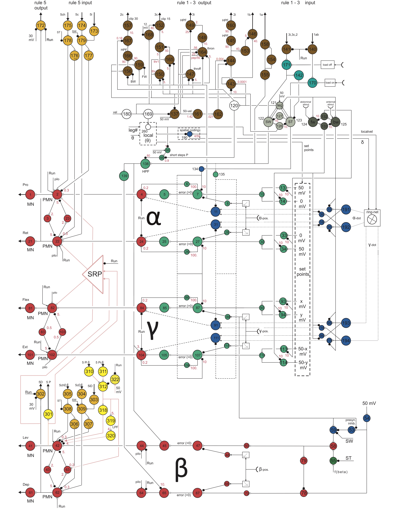

# neuroWalknet 

neuroWalknet [(Schilling and Cruse, 2020)](https://journals.plos.org/ploscompbiol/article/authors?id=10.1371/journal.pcbi.1007804) is a detailed neuronal network model of intraleg and interleg coordination that explains a wide range of behavioral and neurophysiological results of six-legged walking. The neuroWalknet controller builds on the original Walknet (see [Schilling et al., 2013a](https://link.springer.com/article/10.1007/s00422-013-0563-5)) concept which is a decentralized control structure: each leg has its own controller that selects lower level behaviors (swing and stance movements). There are local coordination influences that coordinate the behavior of neighboring legs. Overall, from this approach emerges a wide variety of adaptive and stable walking and climbing behaviors which can deal with disturbances (walking at different velocities, losing one or more legs, ...). It has been applied in dynamic simulation and on different robots (for example, see [Schilling and Cruse, 2017](https://www.frontiersin.org/articles/10.3389/fnbot.2017.00003/full)).
This approach is deeply inspired from insights on walking in stick insects and allows to reproduce behavioral results.

The neuroWalknet approach extends this towards a neurobiological foundation as it is based on a detailed neuron model. It adds a detailed neuronal realization based on an antagonistic structure. 

This repository contains the main code of the neuroWalknet controller which is written in Python3. There are two studies related to this:

* First, the original paper by [Schilling and Cruse (2020)](https://journals.plos.org/ploscompbiol/article/authors?id=10.1371/journal.pcbi.1007804) shows a large variety of walking under different circumstances. For these, the experiments can be found in the directory 'controller/neuro\_walknet'.
* Second, a new study puts a focus on intraleg studies and interjoint reflexes depending on context -- for these, the new experiments can be run through 'controller/neuro\_walknet\_2022'.

In order to run the code, the dynamic simulation environment is required which is realized in C++ and based on the Open Dynamics Engine library, see [https://github.com/malteschilling/hector] (https://github.com/malteschilling/hector) . 

The robot simulator implements a generic simulation environment and a communication protocol to connect controller and simulator (or the real robot) is realized, see Schneider et al, 2011).

For more details on the robot Hector see [Schneider et al., 2014](https://link.springer.com/chapter/10.1007/978-3-319-09435-9_51).

--

### Install and Setup

This is the code base of the neuroWalknet controller which is used to control the robot Hector. For running this code you require the Hector simulator.

In order to run simulations (the python controller and bioflexbus communication interface has been adapted to work under Mac OS X as well):

* Install the Hector simulator (see [https://github.com/malteschilling/hector] (https://github.com/malteschilling/hector) ) and run the simulator.
* Clone/download this controller git repository – ideally, you put both these folders side by side in one parent folder (controller requires some libraries from the simulator for establishing the Bioflexbus protocol and some xml description files).
* compile the BioFlex communication interface to connect controller and simulator: in the comminter folder call 'make'
* Start one of the controller: 
	* 'python3 -O -m controller.neuro_walknet' for the original study by [Schilling and Cruse (2020)](https://journals.plos.org/ploscompbiol/article/authors?id=10.1371/journal.pcbi.1007804) or
	* 'python3 -O -m controller.neuro_walknet_2022' for the new intraleg studies.

Problems: when simulator and and controller folder are not in the same directory (or you renamed the hector folder) - you have to provide the path to the hector folder twice: once in the Makefile while compiling the communication interface. Second, in the __main__ file the XML description files are required ('protocolXmlDirectory="../hector/BioFlexBusProtocolXmls/" ').

--

### Content

The repository consists of multiple folders:

* controller - contains implementation of the neuroWalknet control approach (decentralized, individual leg controllers and coordination rules). 
	* The original controller from the study by [Schilling and Cruse (2020)](https://journals.plos.org/ploscompbiol/article/authors?id=10.1371/journal.pcbi.1007804) with all experiments is contained here in the neuro\_walknet folder. 
	* Simulations for the currently submitted article on intraleg studies are in neuro\_walknet\_2022 (which is a clone of the original controller, but introduces some changes and additional structure as described in the paper).
* GeometryXmls, geomparse - 3D visualization files of Hector and environment - and read method for loading the file on the python side (required to obtain robot variables)
* Visualizations - scripts to produce figures as used in the different articles.
* Hector - interface for connecting to sensors and motors of Hector.
* ProcessOrganisation - generic scheme for running the simulations in modules (and visualizations as well).
* comminter - establishes a connection towards the simulator.
* tools

--

### Overview Controller

Overview of the controller (see Fig. 2 in the original article) - added are the numbers as used in the python code.

--

### Supporting Information: Videos

Currently, we are hosting supplemental videos showing the simulated robot walking in different experimental setups as realized by neuroWalknet [(Schilling and Cruse, 2020)](https://journals.plos.org/ploscompbiol/article/authors?id=10.1371/journal.pcbi.1007804)

#### Forward walking at different velocities:

* NeuralWN_vel15.mp4 – forward walking, velocity neuron set to 15 mV
* NeuralWN_vel20.mp4 – forward walking, velocity neuron set to 20 mV
* NeuralWN_vel25.mp4 – forward walking, velocity neuron set to 25 mV
* NeuralWN_vel30.mp4 – forward walking, velocity neuron set to 30 mV
* NeuralWN_vel35.mp4 – forward walking, velocity neuron set to 35 mV
* NeuralWN_vel40.mp4 – forward walking, velocity neuron set to 40 mV
* NeuralWN_vel45.mp4 – forward walking, velocity neuron set to 45 mV
* NeuralWN_vel50.mp4 – forward walking, velocity neuron set to 50 mV
* NeuralWN_run.mp4 – driven at high velocity includes CPG activation

#### Curve Walking:

* NeuralWN_curve_walking.mp4

#### Backward walking at different velocities:

* NeuralWN_bw20.mp4 – backward walking, velocity neuron set to 20 mV
* NeuralWN_bw30.mp4 – backward walking, velocity neuron set to 30 mV
* NeuralWN_bw40.mp4 – backward walking, velocity neuron set to 40 mV 
* NeuralWN_bw50.mp4 – backward walking, velocity neuron set to 20 mV

For further details on the specific settings for the video and the underlying experimental paradigm see the submitted article Schilling and Cruse, Decentralized Control of Insect Walking – a simple neural network explains a wide range of behavioral and neurophysiological results.

--

### References

* Schilling, M. and Cruse, H. (2020). Decentralized control of insect walking: a simple neural network explains a wide range of behavioral and neurophysiological results. PLoS computational biology 16.4 (2020): e1007804.
* Schilling, M., Hoinville, T., Schmitz, J., & Cruse, H. (2013a). Walknet, a bio-inspired controller for hexapod walking. Biological Cybernetics, 107(4), 397-419. doi:10.1007/s00422-013-0563-5
* Schilling, M., Paskarbeit, J., Hoinville, T., Hüffmeier, A., Schneider, A., Schmitz, J., & Cruse, H. (2013b). A hexapod walker using a heterarchical architecture for action selection. Frontiers in Computational Neuroscience, 7, 126. doi:10.3389/fncom.2013.00126
* Schneider, A., Paskarbeit, J., Schilling, M., & Schmitz, J. (2014). HECTOR, a bio-inspired and compliant hexapod robot. Proceedings of the 3rd Conference on Biomimetics and Biohybrid Systems, Living Machines 2014, 427-430.
